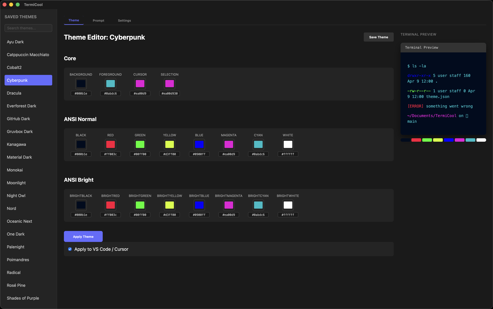
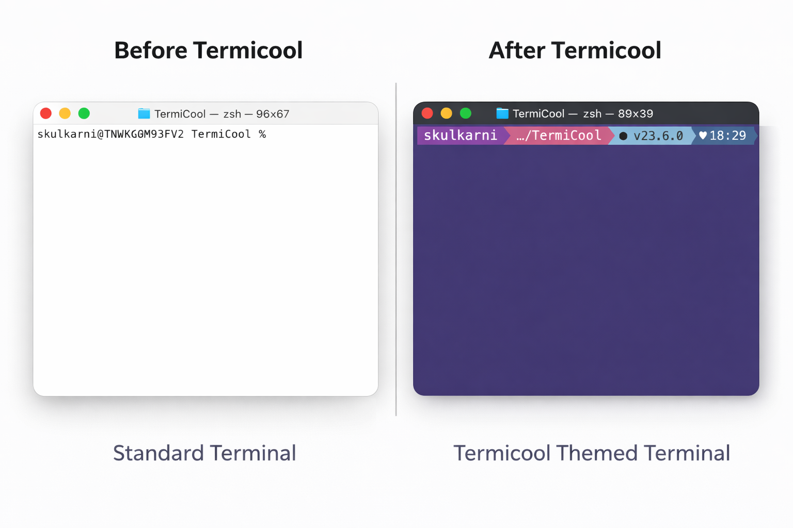
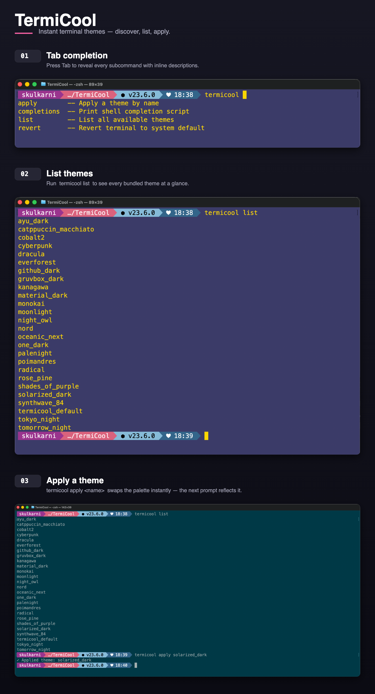
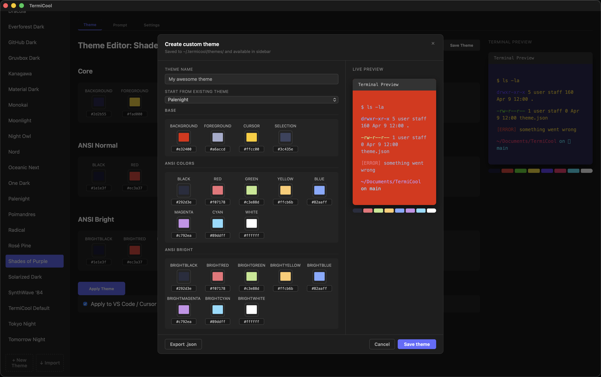

# ⚡ TermiCool

> Instantly transform your terminal — themes, prompts, and styling with zero config.

[](https://sushilkulkarni1389.github.io/termicool)




---

## 🌐 Website

**[sushilkulkarni1389.github.io/termicool](https://sushilkulkarni1389.github.io/termicool)** — full feature overview, animated demo, and platform-specific download links.

---

## 📌 Table of Contents

- [✨ Why TermiCool?](#-why-termicool)
- [🎨 26 Built-in Themes](#-26-built-in-themes)
- [🚀 Quick Start](#-quick-start)
- [🖥️ Applying Themes](#️-applying-themes)
- [💻 CLI Mode](#-cli-mode)
- [🎨 Custom Theme Creator](#-custom-theme-creator)
- [📥 Import & Export Themes](#-import--export-themes)
- [🧩 IDE Theme Sync](#-ide-theme-sync)
- [🧠 Failsafe Engine](#-failsafe-engine)
- [🛠️ Troubleshooting](#️-troubleshooting)
- [🗺️ Roadmap](#️-roadmap)
- [🤝 Contributing](#-contributing)
- [📄 License](#-license)

---

## ✨ Why TermiCool?

Customizing your terminal should take seconds, not hours. Most theme guides involve
manually editing config files, hunting for hex codes, and hoping you can remember
what the original looked like.

TermiCool handles all of it:

- **One click** — pick a theme, apply it instantly
- **Fully reversible** — one click restores your original config, exactly as it was
- **Everywhere** — terminal, prompt, and IDE all sync at once
- **Safe** — write-once backups mean nothing is ever permanently changed



---

## 🎨 26 Built-in Themes

| | | | |
|---|---|---|---|
| Ayu Dark | Catppuccin Macchiato | Cobalt2 | Cyberpunk |
| Dracula | Everforest | GitHub Dark | Gruvbox Dark |
| Kanagawa | Material Dark | Monokai | Moonlight |
| Night Owl | Nord | Oceanic Next | One Dark |
| Palenight | Poimandres | Radical | Rosé Pine |
| Shades of Purple | Solarized Dark | Synthwave '84 | TermiCool Default |
| Tokyo Night | Tomorrow Night | | |

---

## 🚀 Quick Start

### Download

👉 **[Download from the TermiCool website](https://sushilkulkarni1389.github.io/termicool)** — the site auto-detects your OS and shows the right installer.

Or grab a specific build directly from
[GitHub Releases](https://github.com/sushilkulkarni1389/termicool/releases/latest):

| Platform | File |
|----------|------|
| macOS (Universal) | `TermiCool_0.1.0_universal.dmg` |
| Windows (setup) | `TermiCool_0.1.0_x64-setup.exe` |
| Windows (MSI) | `TermiCool_0.1.0_x64_en-US.msi` |
| Linux (Debian/Ubuntu) | `TermiCool_0.1.0_amd64.deb` |
| Linux (Fedora/RHEL) | `TermiCool-0.1.0-1.x86_64.rpm` |
| Linux (Universal) | `TermiCool_0.1.0_amd64.AppImage` |

### First Launch

On first launch TermiCool will:
1. Write 26 built-in themes to `~/.termicool/themes/`
2. Install the [Starship](https://starship.rs) prompt if not already present
3. Download the MesloLGS NF font for Nerd Font glyph support
4. Back up your existing terminal configuration

---

## 🖥️ Applying Themes

1. Select any theme from the sidebar — a live preview appears instantly
2. Click **Apply Theme**
3. Open a new terminal window to see the change

The sidebar supports search, alphabetical sorting, and filter-as-you-type.
Custom and imported themes appear alongside built-ins.

---

## 💻 CLI Mode

Apply themes directly from your terminal without opening the GUI.

### Install the CLI

Go to **Settings → Install CLI**. This places the `termicool` binary at
`~/.local/bin/termicool` (macOS/Linux) or
`%LOCALAPPDATA%\Programs\termicool\termicool.exe` (Windows) and injects
the path into your shell profile automatically.

### Commands

```bash
# Apply a theme by name (exact or partial match)
termicool apply dracula
termicool apply tok        # matches Tokyo Night

# List all available themes
termicool list

# Revert terminal to original config
termicool revert

# Generate shell completion script
termicool completions zsh
termicool completions bash
termicool completions fish
```

### Tab Completion

The CLI installer sets up tab completion automatically. After installing:

```bash
termicool apply <TAB>      # lists all available themes
termicool <TAB>            # lists all commands
```

If completions aren't working after install, open a **new** terminal window
(the fpath injection takes effect in fresh sessions only).

> **Note:** `termicool apply` applies the theme to your terminal and Starship
> prompt only. VS Code / Cursor sync is available in the GUI.



---

## 🎨 Custom Theme Creator

Build your own theme from scratch or start from any built-in.

1. Click **+ New Theme** at the bottom of the sidebar
2. Optionally select a base theme from the **"Start from existing theme"** dropdown
3. Adjust all 20 color values using color pickers or hex inputs:
   - Background, Foreground, Cursor, Selection
   - 8 standard ANSI colors
   - 8 bright ANSI variants
4. The **live terminal preview** on the right updates in real time
5. Click **Save** to add it to your sidebar, or **Export** to save as a `.json` file



---

## 📥 Import & Export Themes

### Import from File

1. Click **↓ Import** in the sidebar
2. Select **From File** tab
3. Pick any `.json` file in TermiCool theme format

### Import from URL

1. Click **↓ Import** in the sidebar
2. Select **From URL** tab
3. Paste any public HTTPS URL pointing to a theme JSON file

Raw GitHub URLs work perfectly — this is the easiest way to share themes
with teammates or the community.

### Theme JSON Format

Themes are plain JSON files. You can share them as GitHub Gists, raw files,
or any public URL.

```json
{
  "name": "My Theme",
  "colors": {
    "background":   "#1e1e2e",
    "foreground":   "#cdd6f4",
    "cursor":       "#f5e0dc",
    "selection":    "#585b70",
    "black":        "#45475a",
    "red":          "#f38ba8",
    "green":        "#a6e3a1",
    "yellow":       "#f9e2af",
    "blue":         "#89b4fa",
    "magenta":      "#f5c2e7",
    "cyan":         "#94e2d5",
    "white":        "#bac2de",
    "bright_black":   "#585b70",
    "bright_red":     "#f38ba8",
    "bright_green":   "#a6e3a1",
    "bright_yellow":  "#f9e2af",
    "bright_blue":    "#89b4fa",
    "bright_magenta": "#f5c2e7",
    "bright_cyan":    "#94e2d5",
    "bright_white":   "#a6adc8"
  }
}
```

> If `bright_*` fields are omitted, they fall back to the standard ANSI colors.

---

## 🧩 IDE Theme Sync

TermiCool can optionally sync your terminal theme colors into VS Code and Cursor.

**How to enable:** Check the **Apply to VS Code / Cursor** checkbox on the
Theme tab before applying a theme. The preference persists across app restarts.

**What it does:** Writes ANSI terminal colors into `workbench.colorCustomizations`
in your IDE's `settings.json`. All your other settings — keybindings, extensions,
editor colors — are completely untouched.

**Revert:** IDE settings are restored along with everything else when you use
Emergency Revert.

### Supported IDEs

| IDE | Status |
|-----|--------|
| VS Code | ✅ Supported |
| Cursor | ✅ Supported |
| PyCharm / JetBrains | ⏸ Suspended — requires a full JetBrains plugin |

> **Note:** IDE sync is GUI-only. The `termicool apply` CLI command applies
> to your terminal and Starship prompt only.

---

## 🧠 Failsafe Engine

TermiCool uses a **write-once backup** model to guarantee safe revert at any time.

1. **First apply** — TermiCool backs up your original config files to
   `~/.termicool/backups/` before making any changes
2. **Subsequent applies** — The backup is never overwritten. It always preserves
   your original pre-TermiCool state, no matter how many themes you switch through
3. **Emergency Revert** — Restores every backed-up file, removes all injected
   shell config blocks, and resets your terminal to its original state

**What revert restores:**
- Shell profile injections (`TERMICOOL_START/END` blocks, Starship init, init scripts)
- macOS Terminal profile
- Windows Terminal `settings.json`
- GNOME Terminal / Alacritty config
- VS Code / Cursor `settings.json` (if IDE sync was used)

**What revert never touches:**
- `~/.termicool/themes/` — your custom and imported themes are kept
- `~/.local/bin/termicool` — the CLI binary stays installed
- `~/.termicool/completions/` — shell completions stay in place

---

## 🛠️ Troubleshooting

### Seeing `?` or boxes instead of icons?

Your terminal font is missing Nerd Font glyphs.

**Fix:** In your terminal emulator's preferences, change the font to
`MesloLGS NF`. TermiCool offers to install this automatically on first launch.

### Theme not applied after switching?

Open a **new** terminal window. TermiCool writes to your shell config —
the change takes effect in new sessions.

If it still doesn't apply, source your config manually:
```bash
source ~/.zshrc   # or ~/.bashrc
```

### Starship prompt not showing after revert + re-apply?

Run Apply Theme from the GUI again — this re-injects the Starship init block
into your shell profile. Then open a new terminal window.

If Starship isn't installed at all:
```bash
starship --version
```
If not found, relaunch TermiCool — it will detect the missing binary and
trigger the auto-installer.

### CLI command not found after install?

Make sure `~/.local/bin` is on your PATH. The **Install CLI** button in
Settings handles this automatically. If you installed manually:
```bash
export PATH="$HOME/.local/bin:$PATH"
```

### Tab completion not working after CLI install?

Open a **new** terminal window — fpath changes only take effect in fresh
sessions. If it still doesn't work:
```bash
grep "termicool" ~/.zshrc
```
You should see a `fpath=(~/.termicool/completions ...)` line appearing
**before** your `compinit` call. If not, click **Reinstall CLI** in Settings.

### Linux startup error?

Check:
- You have write permission to `~/.bashrc` and `~/.zshrc`
- `curl` or `wget` is available (needed for Starship auto-install)
- Include the error message JSON when filing an issue

---

## 🗺️ Roadmap

- [x] IDE integration — VS Code & Cursor
- [x] Custom theme creator with live preview
- [x] CLI mode (`termicool apply`, `termicool list`, tab completion)
- [x] Theme import from file and URL
- [x] Delete custom themes
- [x] Security hardening (strict CSP, scoped filesystem capabilities)
- [x] README & documentation
- [x] GitHub Actions packaging pipeline
- [x] Landing page & product website

---

## 🤝 Contributing

Contributions are welcome!

```bash
# Fork → clone → create a branch
git checkout -b feature/your-feature

# Make changes, then commit
git commit -m "feat: your feature description"

# Push and open a PR
git push origin feature/your-feature
```

Please open an issue first for larger changes so we can discuss the approach.

**Building from source:**
```bash
git clone https://github.com/sushilkulkarni1389/termicool
cd termicool
npm install
npm run tauri dev
```

Requirements: Node v18+, Rust 1.70+, Tauri v2 CLI.

---

## 📄 License

MIT License © 2026 Sushil Kulkarni

---

## ⭐ Support

If TermiCool saved you time:

- ⭐ Star the repo
- 🌐 Share [the website](https://sushilkulkarni1389.github.io/termicool)
- 🐛 [Report a bug](https://github.com/sushilkulkarni1389/termicool/issues)
- 💡 [Suggest a feature](https://github.com/sushilkulkarni1389/termicool/issues)

---

> Built for developers who love beautiful terminals.